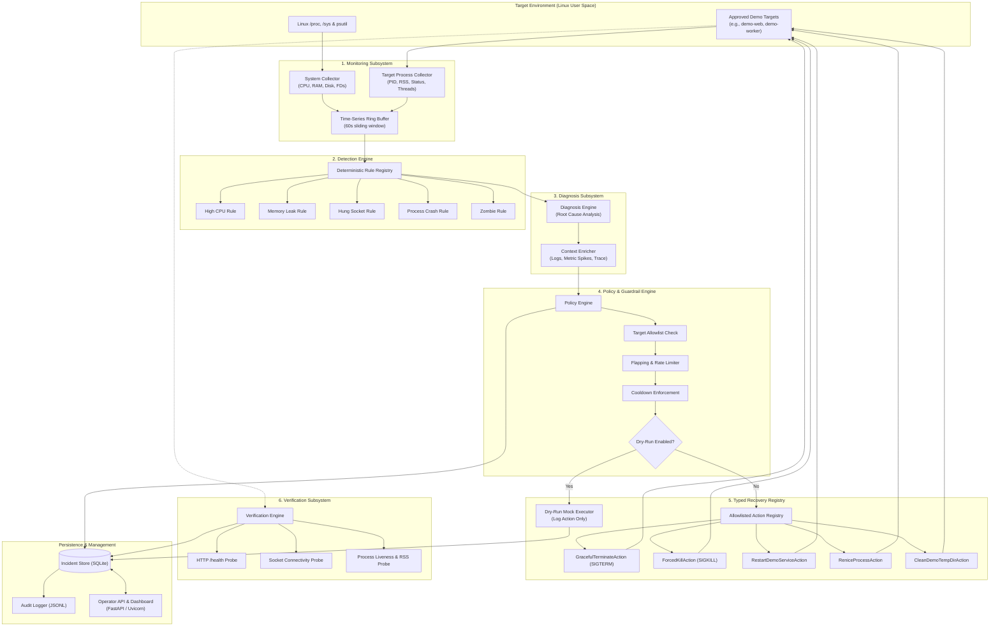

# Architecture Specification: Autonomous Fault Detection & Self-Healing System for Linux

## 1. System Overview & Core Philosophy

The **Autonomous Fault Detection and Self-Healing System for Linux** is an autonomous, user-space reliability engineering framework developed for Linux environments (specifically Ubuntu Linux in a virtual machine).

Unlike conventional recovery scripts or black-box agents that attempt ad-hoc command generation, this framework enforces a **closed-loop, deterministic, safety-constrained architecture**:

$$\mathbf{MONITOR} \longrightarrow \mathbf{DETECT} \longrightarrow \mathbf{DIAGNOSE} \longrightarrow \mathbf{GUARDRAIL} \longrightarrow \mathbf{HEAL} \longrightarrow \mathbf{VERIFY}$$

```
                                    +--------------------+
                                    |  Linux User Space  |
                                    | (Demo Target Apps) |
                                    +---------+----------+
                                              |
                          Telemetry Collection| Action Execution
                                              | & Active Probes
                                              v
+-----------------------------------------------------------------------------------------+
|                                    Core Loop Engine                                     |
|                                                                                         |
|   +-------------+       +------------+       +-------------+       +----------------+   |
|   | 1. MONITOR  | ----> | 2. DETECT  | ----> | 3. DIAGNOSE | ----> | 4. GUARDRAIL   |   |
|   | (psutil/proc)       | (Rules)    |       | (Root Cause)|       | (Policy Checks)|   |
|   +-------------+       +------------+       +-------------+       +-------+--------+   |
|                                                                            |            |
|                                                                            v            |
|   +-------------+                                                  +----------------+   |
|   | 6. VERIFY   | <----------------------------------------------- | 5. HEAL        |   |
|   | (Probes)    |                   Recovery Action                | (Typed Registry|   |
|   +------+------+                                                  |  or Dry-Run)   |   |
|          |                                                         +----------------+   |
+----------|------------------------------------------------------------------------------+
           |
           v
+-----------------------------------------------------------------------------------------+
| Incident Record Store (SQLite + JSONL) & Operator Management API (FastAPI)              |
+-----------------------------------------------------------------------------------------+
```

### Safety Principles & Invariants
1. **Zero Arbitrary Shell Execution**: The system strictly forbids running arbitrary shell strings or dynamic shell commands. All remediation actions are represented by typed, compiled, allowlisted Python classes.
2. **Explicit Target Allowlist**: The system refuses to inspect, signal, or modify any process or service outside of an explicitly declared `TargetRegistry`. Host operating system processes, kernel threads, user shells, and unrelated services cannot be affected.
3. **Mandatory Guardrail Evaluation**: No recovery action can be dispatched without passing through the `PolicyEngine`. Guardrails evaluate target eligibility, flapping history, cooldown constraints, and dry-run flags.
4. **Deterministic Priority**: Fault detection is rooted in deterministic, transparent rule sets. Statistical or machine learning anomaly detection (such as Isolation Forest) is deferred until rule-based pipelines are verified, and is used strictly for advisory diagnosis rather than direct autonomous recovery.
5. **Auditable Incident Records**: Every lifecycle iteration that triggers a diagnosis or healing intervention produces an immutable incident record in SQLite and append-only JSONL.
6. **Closed-Loop Verification**: Every recovery action must be followed by an active verification step (e.g., HTTP health checks, socket availability, process stability). If verification fails, the system safely escalates and halts further automated attempts to prevent cascading damage.
7. **Dry-Run Capability**: The framework supports a first-class `DRY_RUN` mode where all detection, diagnosis, and policy decisions occur normally, but recovery actions are logged without altering OS state.

---

## 2. System Architecture Diagram



---

## 3. Component Deep Dive

### 3.1 Monitoring Subsystem (`self_healing.monitoring`)
- **Responsibilities**:
  - Sample global system metrics (overall CPU, memory, swap, disk I/O, load averages).
  - Sample per-process metrics strictly for targets matching approved criteria in `TargetRegistry`.
  - Maintain a lightweight in-memory sliding window (e.g., 60 samples at 1 Hz) for trend and differential calculations.
- **Key Classes**:
  - `SystemCollector`: Queries `psutil.virtual_memory()`, `psutil.cpu_percent()`, and `/proc/loadavg`.
  - `TargetProcessCollector`: Iterates over approved targets, queries `psutil.Process(pid)`, reading `cpu_percent`, `memory_info`, `num_threads`, `num_fds`, `status`, and `connections`.
  - `MetricRingBuffer`: Fixed-size sliding circular buffer providing rolling window statistics (mean, delta, peak).

### 3.2 Target Registry & Scope Enforcement (`self_healing.targets`)
- **Responsibilities**:
  - Maintain an immutable, strongly-typed allowlist of supervised demo targets.
  - Enforce hard boundaries preventing any interaction with host OS processes.
- **Specification**:
  ```python
  class TargetSpec(BaseModel):
      target_id: str             # e.g., "demo-web-worker"
      process_name: str          # e.g., "python3"
      cmdline_substring: str     # e.g., "demo_web_service.py"
      expected_port: Optional[int] = 8080
      working_dir_prefix: str    # e.g., "/home/arskage/linux-self-healing/demo"
      max_restarts_per_window: int = 3
      cooldown_seconds: float = 30.0
      health_check_url: Optional[str] = "http://127.0.0.1:8080/health"
  ```
- **Forbidden Targets**:
  - PID 1 (`init` / `systemd`), kernel threads (PID $\le$ 2), SSH daemons (`sshd`), system logging, shell processes (`bash`, `zsh`, `sh`), and any process outside the project workspace. Any attempt to target these raises an immediate `SecurityViolationError`.

### 3.3 Detection Engine (`self_healing.detection`)
- **Responsibilities**:
  - Evaluate streaming metrics against transparent deterministic rules.
  - Yield strongly typed `FaultEvent` instances when fault criteria are met.
- **Deterministic Rule Registry**:
  1. `HighCpuRule`: Triggers if process CPU $> 90\%$ sustained for $\ge 5$ consecutive seconds.
  2. `MemoryLeakRule`: Triggers if process RSS memory continuously grows without GC release and exceeds configured budget (e.g., $> 250\text{ MB}$).
  3. `HungProcessRule`: Triggers if the process's exposed TCP port fails to accept connections or HTTP `/health` times out for $\ge 5$ seconds.
  4. `ZombieProcessRule`: Triggers if child processes of the target remain in `psutil.STATUS_ZOMBIE` state for $\ge 10$ seconds.
  5. `ProcessCrashRule`: Triggers if a supervised target abruptly disappears from process tables without clean shutdown.
  6. `FileDescriptorExhaustionRule`: Triggers if `num_fds` exceeds $85\%$ of the target's soft limit.

### 3.4 Diagnosis Subsystem (`self_healing.diagnosis`)
- **Responsibilities**:
  - Differentiate between transient resource spikes and actionable faults.
  - Correlate metric history with process attributes to formulate a root cause diagnosis.
  - Propose an abstract recovery strategy (e.g., `RECOMMEND_RESTART`, `RECOMMEND_THROTTLE`, `RECOMMEND_CLEANUP`).
- **Key Output**:
  - `DiagnosisReport`: Contains `target_id`, `fault_type`, `root_cause_summary`, `confidence` ($0.0 - 1.0$), `telemetry_snapshot`, and `suggested_action_type`.

### 3.5 Policy & Guardrails Layer (`self_healing.policy`)
- **Responsibilities**:
  - Provide an authoritative gatekeeper between diagnosis recommendations and recovery action dispatch.
  - Reject actions violating safety, rate limits, or blast-radius limits.
- **Enforced Policies**:
  1. **Allowlist Compliance**: Verifies target matches an active entry in `TargetRegistry`.
  2. **Rate Limiting / Flapping Prevention**: Tracks recent healing actions per target. If a target fails more than $N$ times within $M$ minutes, the target is marked `FLAPPING` and locked out from further automated action; an alert is generated.
  3. **Cooldown Window**: Ensures a minimum quiet period between actions on the same target.
  4. **Dry-Run Enforcement**: In `dry_run=True` mode, passes the action to the dry-run executor rather than the real executor.

### 3.6 Typed Allowlisted Recovery Registry (`self_healing.recovery`)
- **Responsibilities**:
  - Execute remediation actions using strictly typed Python implementations.
  - **No raw shell interpretation**: Disallows `shell=True`, string concatenation of commands, or unallowlisted binaries.
- **Allowlisted Actions**:
  | Action Class | Implementation Mechanism | Allowed Parameters |
  | :--- | :--- | :--- |
  | `GracefulTerminateAction` | `os.kill(pid, signal.SIGTERM)` with timeout wait | `timeout_seconds: float = 5.0` |
  | `ForcedKillAction` | `os.kill(pid, signal.SIGKILL)` after failed SIGTERM | `target_pid: int` |
  | `RestartDemoServiceAction` | Terminate target + spawn via `subprocess.Popen([sys.executable, script_path], shell=False)` | `service_id: str` |
  | `ReniceProcessAction` | `psutil.Process(pid).nice(value)` | `nice_value: int` ($0 \le \text{val} \le 19$) |
  | `CleanDemoTempDirAction` | `shutil.rmtree` / `os.unlink` on allowlisted `demo/scratch/` | `subfolder: str` (strictly validated against directory traversal) |

### 3.7 Verification Subsystem (`self_healing.verification`)
- **Responsibilities**:
  - Execute post-healing verification probes to confirm health restoration.
  - Multi-stage sampling (e.g., at $t+2\text{s}$, $t+5\text{s}$, and $t+10\text{s}$) to avoid false-positive transient recovery.
- **Probes**:
  - `ProcessAliveProbe`: Checks if newly spawned PID is running and not in zombie or error state.
  - `HealthEndpointProbe`: Issues an HTTP GET to `/health` with timeout.
  - `ResourceStabilizationProbe`: Ensures CPU and memory usage have dropped below alert thresholds.
- **Verification Outcomes**:
  - `VERIFIED_SUCCESS`: Target is operating within nominal parameters.
  - `VERIFICATION_FAILED`: Target failed to recover. Triggers escalation and incident closure with failure status.

### 3.8 Incident Storage & Audit Trail (`self_healing.incidents`)
- **Responsibilities**:
  - Record the complete lifecycle of every fault event, policy check, action, and verification result.
- **Storage Dual-Write**:
  1. **SQLite Database** (`data/incidents.db`): Supports fast relational queries, filtering by target, timestamp, and status.
  2. **Audit Log** (`logs/incidents.jsonl`): Structured, append-only JSON Lines stream for tamper-resistant system auditing.

### 3.9 Operator API & Management Dashboard (`self_healing.api`)
- **Responsibilities**:
  - Provide observability and operator control over the self-healing daemon.
- **Endpoints**:
  - `GET /health`: Daemon status and health.
  - `GET /api/v1/status`: Summary of system metrics, active targets, and guardrail state.
  - `GET /api/v1/incidents`: Query recent incidents with filters (`limit`, `target_id`, `status`).
  - `GET /api/v1/incidents/{incident_id}`: Full lifecycle details for a specific incident.
  - `POST /api/v1/policy/dry-run`: Set dry-run mode (`{"enabled": true/false}`).
  - `POST /api/v1/targets/register`: Add or update a supervised demo target.

### 3.10 Controlled Demo Workloads & Fault Injectors (`self_healing.demo`)
- **Responsibilities**:
  - Provide controlled, deterministic test workloads for validation and demonstration without endangering the host system.
- **Components**:
  - `demo_web_service.py`: Minimal FastAPI/HTTP service exposing `/health`, `/work`, and controllable failure endpoints.
  - `demo_worker_service.py`: Simulates background worker polling a queue.
  - `inject_cpu_spin.py`: Drives CPU usage of a demo target to 100%.
  - `inject_memory_leak.py`: Simulates monotonic memory allocation.
  - `inject_hung_socket.py`: Simulates unresponsive server or deadlocked thread.
  - `inject_crash.py`: Induces abrupt process termination.

---

## 4. Data Contracts & Pydantic Schemas

```python
from datetime import datetime
from enum import Enum
from typing import Any, Dict, List, Optional
from pydantic import BaseModel, Field

class FaultSeverity(str, Enum):
    LOW = "LOW"
    MEDIUM = "MEDIUM"
    HIGH = "HIGH"
    CRITICAL = "CRITICAL"

class FaultType(str, Enum):
    HIGH_CPU = "HIGH_CPU"
    MEMORY_LEAK = "MEMORY_LEAK"
    HUNG_PROCESS = "HUNG_PROCESS"
    PROCESS_CRASH = "PROCESS_CRASH"
    ZOMBIE_PROCESS = "ZOMBIE_PROCESS"
    FD_EXHAUSTION = "FD_EXHAUSTION"

class MetricSnapshot(BaseModel):
    timestamp: datetime = Field(default_factory=datetime.utcnow)
    system_cpu_percent: float
    system_memory_percent: float
    target_pid: Optional[int] = None
    target_cpu_percent: Optional[float] = None
    target_rss_bytes: Optional[int] = None
    target_num_threads: Optional[int] = None
    target_num_fds: Optional[int] = None

class FaultEvent(BaseModel):
    event_id: str
    target_id: str
    fault_type: FaultType
    severity: FaultSeverity
    detected_at: datetime = Field(default_factory=datetime.utcnow)
    triggering_value: float
    threshold_value: float
    description: str

class DiagnosisReport(BaseModel):
    diagnosis_id: str
    event_id: str
    target_id: str
    fault_type: FaultType
    root_cause: str
    confidence: float
    recommended_action: str
    telemetry_window: List[MetricSnapshot]

class PolicyDecision(BaseModel):
    decision_id: str
    diagnosis_id: str
    allowed: bool
    is_dry_run: bool
    rejection_reason: Optional[str] = None
    target_id: str
    action_type: str
    action_params: Dict[str, Any]

class RecoveryResult(BaseModel):
    action_id: str
    target_id: str
    action_type: str
    executed_at: datetime = Field(default_factory=datetime.utcnow)
    success: bool
    dry_run: bool
    execution_latency_ms: float
    output_message: str

class VerificationStatus(str, Enum):
    HEALTHY = "HEALTHY"
    FAILED = "FAILED"
    FLAPPING = "FLAPPING"
    TIMEOUT = "TIMEOUT"

class VerificationResult(BaseModel):
    verification_id: str
    incident_id: str
    status: VerificationStatus
    verified_at: datetime = Field(default_factory=datetime.utcnow)
    checks_passed: List[str]
    checks_failed: List[str]
    details: str

class IncidentRecord(BaseModel):
    incident_id: str
    target_id: str
    started_at: datetime
    completed_at: Optional[datetime] = None
    fault_event: FaultEvent
    diagnosis: DiagnosisReport
    policy_decision: PolicyDecision
    recovery_result: Optional[RecoveryResult] = None
    verification_result: Optional[VerificationResult] = None
    final_status: str
```

---

## 5. Security & Threat Model

| Threat / Risk | Mitigating Architecture |
| :--- | :--- |
| **Command Injection via AI / Input** | Completely prohibited by design. No shell execution primitives (`subprocess.call(shell=True)`, `os.system`) exist in recovery code. Actions are compiled Python classes with explicit typed parameters. |
| **Host System Process Termination** | `TargetRegistry` strictly validates PIDs against known demo service paths and working directories. Critical PIDs (1, kernel, daemons, user session) are blocked by hardcoded kernel/system filters. |
| **Recovery Loop Storm (Flapping)** | `PolicyEngine` tracks recovery attempts over a sliding window. If a target exceeds 3 recoveries in 15 minutes, automated actions are blocked, the target is locked out, and escalation is recorded. |
| **Privilege Escalation** | The framework runs as an unprivileged standard user (`arskage`) in user space. It does not require `root` or `sudo` to supervise and restart user demo processes. |
| **Data Loss via Cleanup** | Directory cleaning actions (`CleanDemoTempDirAction`) are path-jailed strictly to `./demo/scratch/` and disallow path traversal (`../`) or absolute path overrides. |
| **Transient False Positives** | Detection rules require multi-sample sustained threshold breaches (e.g., 5 consecutive seconds) rather than single spikes. |

---

## 6. Project Directory Layout

```
linux-self-healing/
├── AGENTS.md                  # System rules and agent instructions
├── PROJECT_PLAN.md            # Phased implementation plan
├── ARCHITECTURE.md            # Detailed architecture specification (this file)
├── pyproject.toml             # Python package configuration & dependencies
├── README.md                  # Project overview & quickstart
├── config/
│   ├── default_config.yaml    # Baseline configuration & thresholds
│   └── targets.yaml           # Allowlisted demo target definitions
├── data/                      # Local SQLite store (gitignored)
│   └── incidents.db
├── logs/                      # Structured JSONL audit logs (gitignored)
│   └── incidents.jsonl
├── src/
│   └── self_healing/
│       ├── __init__.py
│       ├── core/              # Shared types, models & base contracts
│       │   ├── __init__.py
│       │   ├── models.py
│       │   └── exceptions.py
│       ├── targets/           # Target registry & allowlist filters
│       │   ├── __init__.py
│       │   ├── registry.py
│       │   └── validator.py
│       ├── monitoring/        # System & process metrics collectors
│       │   ├── __init__.py
│       │   ├── system.py
│       │   ├── process.py
│       │   └── ring_buffer.py
│       ├── detection/         # Deterministic rule engine
│       │   ├── __init__.py
│       │   ├── engine.py
│       │   └── rules/
│       │       ├── cpu.py
│       │       ├── memory.py
│       │       ├── hung.py
│       │       ├── crash.py
│       │       └── zombie.py
│       ├── diagnosis/         # Root cause analysis & context enrichment
│       │   ├── __init__.py
│       │   ├── engine.py
│       │   └── context.py
│       ├── policy/            # Guardrails, rate-limiters & dry-run
│       │   ├── __init__.py
│       │   ├── engine.py
│       │   └── guardrails.py
│       ├── recovery/          # Typed allowlisted recovery actions
│       │   ├── __init__.py
│       │   ├── base.py
│       │   ├── registry.py
│       │   └── actions/
│       │       ├── terminate.py
│       │       ├── restart.py
│       │       ├── renice.py
│       │       └── cleanup.py
│       ├── verification/      # Post-healing health verification
│       │   ├── __init__.py
│       │   ├── engine.py
│       │   └── probes.py
│       ├── incidents/         # SQLite persistence & audit logging
│       │   ├── __init__.py
│       │   ├── store.py
│       │   └── audit.py
│       ├── api/               # FastAPI operator endpoints & dashboard
│       │   ├── __init__.py
│       │   ├── app.py
│       │   └── routes/
│       └── runner.py          # Main daemon orchestration loop
├── demo/                      # Controlled demo targets & fault injectors
│   ├── scratch/               # Controlled directory for cleanup tests
│   ├── workloads/
│   │   ├── demo_web_service.py
│   │   └── demo_worker_service.py
│   └── injectors/
│       ├── inject_cpu_spin.py
│       ├── inject_memory_leak.py
│       ├── inject_hung_socket.py
│       └── inject_crash.py
└── tests/                     # Unit, integration & chaos test suites
    ├── conftest.py
    ├── test_monitoring.py
    ├── test_targets.py
    ├── test_detection_rules.py
    ├── test_policy_guardrails.py
    ├── test_recovery_registry.py
    ├── test_verification.py
    ├── test_incidents_store.py
    └── test_end_to_end_loop.py
```
